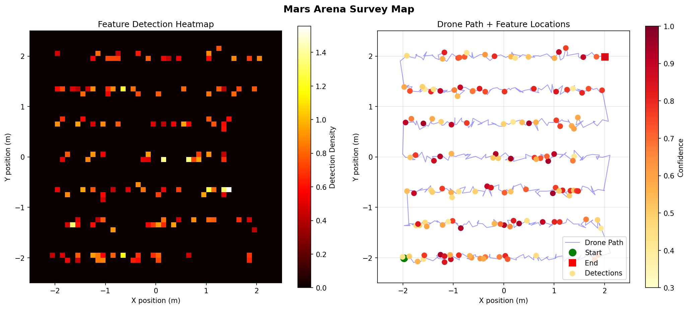
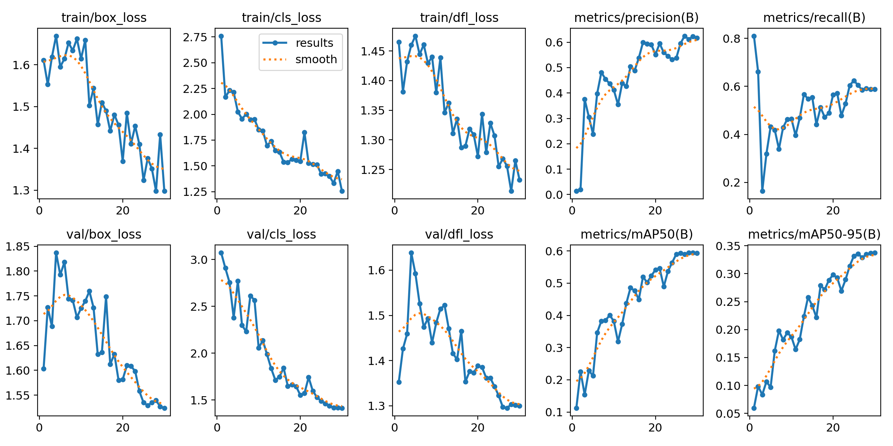

# Mars Terrain Mapper

Real-time Mars geological feature detection and arena mapping pipeline.
Built for **ISRO ASCEND Round 2** — autonomous planetary survey drone.


---

## What This Project Does

Imagine a drone flying over a simulated Mars surface arena.
It needs to find rocks, minerals, and geological features — autonomously,
without GPS, without human control.

This project is the **software brain** that makes that possible:

1. A camera on the drone captures live footage of the arena floor
2. A deep learning model (YOLOv8) looks at each frame and detects rocks
3. A sensor fusion algorithm (EKF) tracks exactly where the drone is
4. A mapping system builds a live 2D map showing where every rock was found

By the end of a flight, you get a complete survey map of the arena —
every geological feature located and logged.

---

## Demo Output

### Arena Survey Map


**Left:** Detection density heatmap — brighter = more rocks detected there
**Right:** Drone flight path (blue line) with detection locations
color-coded by confidence score

### Training Results


---

## Competition Context

This project was built for **ISRO ASCEND 2025**
(Autonomous Systems Challenge for Engineering and Navigation Drones).

- Round 1: Qualified
- Round 2: Autonomous Mars terrain survey with geological feature detection
- Arena simulates Mars surface with rocks, minerals, ice patches
- Drone must survey entire arena and map feature locations

**Real hardware being used:**

| Component | Hardware |
|---|---|
| Flight Controller | Pixhawk 6x |
| Onboard Computer | Jetson Nano |
| Camera | Intel RealSense D series (RGB + Depth) |
| Base Station | Jetson Orin NX |
| Video Link | UDP + GStreamer pipeline |
| Competition | ISRO ASCEND 2025 |

---

## Results

| Component | What It Measures | Our Result |
|---|---|---|
| Rock Detection (mAP50) | % of rocks correctly detected | **0.593 (59.3%)** |
| Rock Detection (mAP50-95) | Stricter detection accuracy | **0.337** |
| Position Estimation (RMSE) | Average position error | **0.156 m** |
| vs Dead Reckoning | How much EKF helps | **95.2% improvement** |
| Inference Speed | How fast detection runs | **70ms per frame** |
| Training Time | Time to train on CPU | **0.461 hours** |

---

## How It Works — Simple Explanation

### The Problem: Where Am I?

The drone has two sensors:
- **IMU** (accelerometer + gyroscope) — tells how the drone is moving,
  but drifts over time. Like walking blindfolded — small errors add up.
- **Optical Flow** — camera watching the ground to measure speed,
  but noisy. Unreliable readings every few frames.

Neither sensor alone is good enough. Together, with smart math, they're
very accurate.

### The Solution: Extended Kalman Filter (EKF)

The EKF is the algorithm that combines both sensors intelligently.

Think of it like two friends giving you directions:
- Friend A (IMU) says "I think we moved 10 meters" — but he's
  been drinking, errors compound over time
- Friend B (Optical Flow) says "I see we're moving at 2 m/s"
  — but he's occasionally unreliable

EKF weighs both opinions based on how trustworthy each is right now,
and produces a better estimate than either alone.

The weight it calculates is called the **Kalman Gain** — the heart
of the algorithm.

**Our result:** EKF reduces position error by 95.2% compared to using
the IMU alone (from 3.23m error down to 0.156m).

### The Detection: YOLOv8

YOLOv8 is a state-of-the-art neural network for object detection.
We took a pretrained model (trained on everyday objects) and
fine-tuned it on 593 real Mars surface images.

After training, it can look at a frame from the drone camera and
draw boxes around every rock it finds, with a confidence score.

**Our result:** 59.3% mAP50 — detects rocks reliably enough for
arena survey mapping.

### The Map: ArenaMapper

Every time YOLOv8 detects a rock, the mapper:
1. Takes the drone's EKF-estimated position
2. Records a detection at that location
3. Updates the 2D grid map

After the full survey, you have a complete heatmap of the arena
showing exactly where geological features were found.

---

## Project Structure
```
mars-terrain-mapper/
│
├── src/                          # Core library code
│   ├── __init__.py               # Makes src a Python package
│   ├── ekf_tracker.py            # EKF sensor fusion algorithm
│   ├── detect.py                 # YOLOv8 inference pipeline
│   ├── mapper.py                 # 2D arena map builder
│   └── utils/
│       └── __init__.py           # Utility functions (expandable)
│
├── scripts/                      # Runnable scripts
│   ├── train.py                  # Fine-tune YOLOv8 on Mars data
│   ├── evaluate.py               # Evaluate model on test set
│   ├── run_pipeline.py           # Full end-to-end demo
│   └── download_dataset.py       # Download dataset from Roboflow
│
├── config/
│   └── config.yaml               # All settings in one place
│
├── tests/
│   └── test_ekf.py               # Unit tests for EKF (5 tests)
│
├── data/
│   └── raw/                      # Dataset lives here (not tracked)
│
├── models/
│   └── weights/                  # Saved model weights (not tracked)
│
├── results/
│   ├── plots/                    # Output maps and training graphs
│   └── videos/                   # Demo recordings
│
├── requirements.txt              # Python dependencies
└── README.md                     # This file
```

---

## Key Files Explained

### `src/ekf_tracker.py` — The Position Estimator

This is the EKF implemented from scratch using only NumPy.
No external Kalman filter library — every equation written manually.

The EKF runs in a loop, every timestep doing two things:

**PREDICT** — using IMU, guess where we are now
```
"Based on my last position and current acceleration,
I am probably HERE now"
```

**UPDATE** — use optical flow to correct that guess
```
"Optical flow says I'm slightly off —
let me adjust by this much"
```

Key matrices:
- `F` — State transition matrix (physics: pos += vel * dt)
- `B` — Control input matrix (how IMU affects state)
- `H` — Observation matrix (optical flow measures velocity)
- `Q` — Process noise (how much we distrust our prediction)
- `R` — Measurement noise (how noisy is optical flow)
- `P` — Covariance matrix (current uncertainty)
- `K` — Kalman Gain (how much to trust sensor vs prediction)

Usage:
```python
from src.ekf_tracker import EKFTracker

ekf = EKFTracker(dt=0.01)
position = ekf.step(imu_acceleration, optical_flow_velocity)
```

---

### `scripts/train.py` — The Model Trainer

Fine-tunes YOLOv8n on our Mars rock detection dataset.

- Base model: `yolov8n.pt` (3 million parameters, pretrained on COCO)
- Dataset: 593 Mars surface images from Roboflow
- Split: 193 train / 60 validation / 29 test
- Epochs: 30
- Final mAP50: 0.593

Training command:
```bash
python scripts/train.py
```

Trained weights are saved to:
```
runs/detect/results/mars_detector/weights/best.pt
```

---

### `src/detect.py` — The Rock Detector

Loads the trained model and runs inference on images.

Usage:
```python
from ultralytics import YOLO

model = YOLO("runs/detect/results/mars_detector/weights/best.pt")
results = model("path/to/mars_image.jpg")

for box in results[0].boxes:
    confidence = float(box.conf)
    class_name = results[0].names[int(box.cls)]
    print(f"Detected: {class_name} at {confidence:.2f} confidence")
```

---

### `src/mapper.py` — The Arena Map Builder

Takes drone positions and detection confidences, builds a 2D survey map.
```python
from src.mapper import ArenaMapper

mapper = ArenaMapper(arena_size=5.0)  # 5x5 metre arena

# As drone flies:
mapper.drone_path.append((x, y))
mapper.add_detection(x, y, confidence=0.85)

# At end of flight:
mapper.stats()
mapper.show()
```

Produces two plots:
- **Heatmap** — detection density across arena grid
- **Scatter map** — exact detection locations with confidence colors

---

### `config/config.yaml` — Central Configuration

All settings in one place. Change parameters here without touching code.
```yaml
model:
  confidence_threshold: 0.3    # minimum confidence to count detection

ekf:
  imu_noise: 0.5               # how noisy is our IMU
  flow_noise: 0.3              # how noisy is optical flow

mapper:
  arena_size: 5.0              # arena is 5x5 metres
  min_confidence: 0.3          # ignore low confidence detections
```

---

### `tests/test_ekf.py` — Unit Tests

5 automated tests verify the EKF works correctly:
```bash
python tests/test_ekf.py
```

Expected output:
```
-- EKFTracker Unit Tests --------------------
[PASS] test_ekf_initializes
[PASS] test_ekf_predict_moves
[PASS] test_ekf_update_corrects
[PASS] test_ekf_rmse_below_threshold (RMSE=0.1513)
[PASS] test_ekf_reset
[PASS] All tests passed!
```

---

## Setup and Installation
```bash
# 1. Clone the repository
git clone https://github.com/kalesha681/mars-terrain-mapper.git
cd mars-terrain-mapper

# 2. Install dependencies
pip install -r requirements.txt

# 3. Download the Mars dataset
python scripts/download_dataset.py

# 4. Train the model (takes ~30 mins on CPU)
python scripts/train.py

# 5. Run the full pipeline demo
python scripts/run_pipeline.py

# 6. Run unit tests
python tests/test_ekf.py
```

---

## Dataset

**Mars Rock Detection Dataset** via Roboflow

- 593 Mars surface images (640x640)
- Real Curiosity and Perseverance rover imagery
- Pre-labeled bounding boxes for rock detection
- Train/validation/test split included
- Source: https://universe.roboflow.com/mars-vitij/mars-yrjkm

---

## Dependencies
```
ultralytics==8.4.21     # YOLOv8
opencv-python==4.13.0   # Image processing
torch==2.10.0           # Deep learning
numpy==2.4.3            # Numerical computing
matplotlib==3.10.8      # Visualization
scipy==1.17.1           # Scientific computing
roboflow                # Dataset download
pyyaml                  # Config file parsing
```

Install all at once:
```bash
pip install -r requirements.txt
```

---

## Deployment on Jetson Nano

When hardware is available, swap the dataset images for live camera:
```python
# Current (dataset):
results = model("path/to/image.jpg")

# Deployment (RealSense):
import pyrealsense2 as rs
pipeline = rs.pipeline()
pipeline.start()
frames = pipeline.wait_for_frames()
color_frame = frames.get_color_frame()
results = model(np.asanyarray(color_frame.get_data()))
```

For faster inference on Jetson, convert to TensorRT:
```bash
yolo export model=best.pt format=engine device=0
```

Expected speedup: 70ms/frame (CPU) → ~15ms/frame (Jetson TensorRT)

---

## Author

**Kalesha Shaik**
Undergraduate Researcher — Aerial Robotics and Autonomous Drones
RGUKT Nuzvid, EEE (2023–2027)

Research interests: GPS-denied aerial navigation, sensor fusion,
nonlinear control of quadrotors, swarm robotics,
simulation-to-real transfer

Email: kalesha681@gmail.com
LinkedIn: https://linkedin.com/in/kalesha681
GitHub: https://github.com/kalesha681

---

## License

MIT License — free to use, modify, and build on this work.